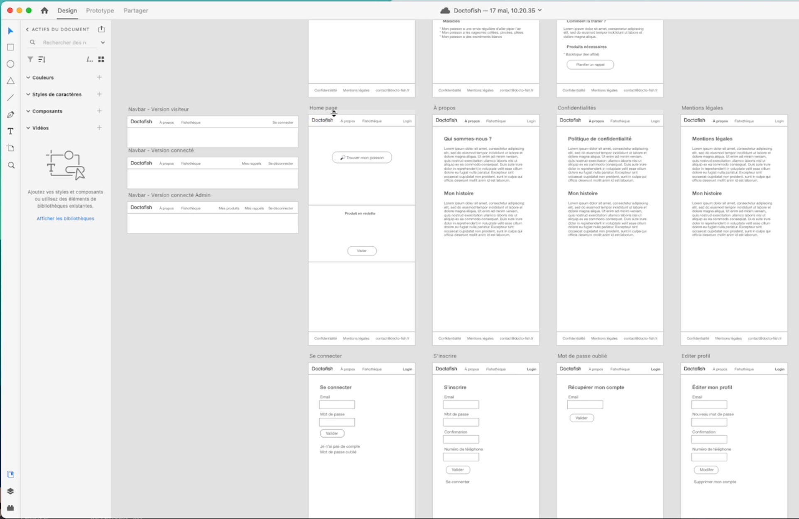
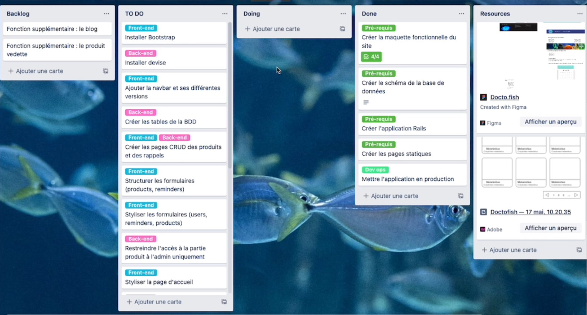
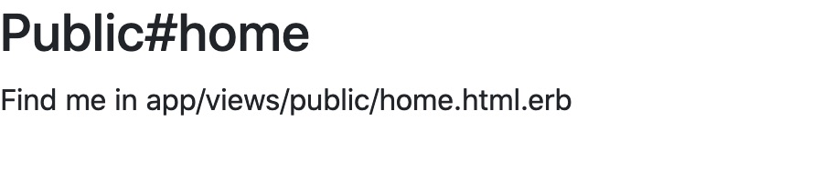

## <p align="center">🐙🐳🐡&nbsp; &nbsp; Fish Health &nbsp; &nbsp;🐟🐠🦀</p>

### <p align="center"><span style="color:orange" >(a <b style="color:red" >💎 Ruby</b> <em>side-project</em>)</span></p>


### [ <p align="center">🚀 &nbsp; <b>from the original Tuto Project "Doctofish" by Harry JMG</b> </p> ](https://github.com/harryjmg/doctofish)


[ ] &nbsp; <em>todo : make a summary (with links)</em>

---
 
#### 📺 &nbsp; <em style="color:lightblue"> ref. video : </em> <span style="color:lightgreen" > "Doctofish Part 2 - 24 May 2022"</span>




### Step 1. Ruby & Rails install :
 
🟢 for this tuto, verify Ruby(3.0.3) & Rails(7.0.3) versions :
```
ruby -v; # ('ruby 3.0.3p157...' ?)
rails -v; # ('Rails 7.0.3' ?)
```

🟢 Install Ruby 3.0 :

📌 ref. doc. : [Installing Ruby using Homebrew](https://www.ruby-lang.org/en/documentation/installation/#homebrew)

```
# brew install rbenv;
ruby -v;
gem install bundler;
rbenv versions;
rbenv install -v 3.0.3;
rbenv shell 3.0.3;
rbenv global 3.0.3;
rbenv local 3.0.3;
echo 'export PATH="/usr/local/opt/ruby@3.0.3/bin:$PATH"' >> ~/.zshrc;
echo 'eval "$(rbenv init - zsh)"' >> ~/.zshrc;
echo 'export PATH="$HOME/.gem/ruby/X.X.X/bin:$PATH"' >> ~/.zshrc;
export PATH="$HOME/.gem/ruby/3.0.3/bin:$PATH";
export LDFLAGS="-L/usr/local/opt/ruby@3.0.3/lib";
export CPPFLAGS="-I/usr/local/opt/ruby@3.0.3/include";
export PKG_CONFIG_PATH="/usr/local/opt/ruby@3.0.3/lib/pkgconfig";
source ~/.zshrc;
rbenv init;
ruby -v; # ('ruby 3.0.3p157...' ?)
rbenv local; # ('3.0.3' ?)
rbenv global; # ('3.0.3' ?)
rbenv shell; # ('3.0.3' ?)
```
---
📌 Caution : "optional"
  
If necessary (e.g. : <b>if there was a problem during the installation stage </b>), you can try to remove Ruby completely from your Mac by following these steps :

```
sudo rm -rf /usr/local/bin/ruby*;
sudo rm -rf /usr/local/lib/ruby*;
brew uninstall ruby;
sudo rm -rf /Library/Ruby/*;
source ~/.zshrc;
rails -v;
```
---

🟢 install Rails 7.0 :

📌 ref. doc. : [Getting Started with Rails](https://guides.rubyonrails.org/getting_started.html)

```
rails -v;
gem install rails -v 7.0.3;
source ~/.zshrc;
rails -v; # ('Rails 7.0.3' ?)

```
### Step 2. Create New Project :

```
rails new fish-health --datbase=postgresql
```
🟢  in Gemfile (update the 'gem' part):
```ruby "3.0.3"
gem "rails", "~> 7.0.3"
gem "sprockets-rails"
gem "pg", "~> 1.1" 
gem "puma", "~> 5.0"
gem "importmap-rails"
gem "turbo-rails"
gem "stimulus-rails"
gem "jbuilder"
gem "redis", "~> 4.0" 
gem "tzinfo-data", platforms: %i[ mingw mswin x64_mingw jruby ]
gem "bootsnap", require: false
```
🟢 and run :
```
bundle install
```

---
📌 Caution : "optional"
  
- If necessary (e.g. : <b>if there was a problem during the installation stage </b>), you can try to install PostgreSQL by running the following command:
```
brew install postgresql
```
- After the installation is complete, start the PostgreSQL server by running the following command:

```
brew services start postgresql;
brew services list
```
- To verify that PostgreSQL is running, you can run the following command:
```
psql postgres
```
If you don't see a message that says "psql: FATAL: database 'postgres' does not exist", that means PostgreSQL is installed and running properly. You can exit psql by typing '\q'.

- Once 'PostgreSQL' is installed, you can try running <b>'gem install pg'</b> again

---

🟢 change project database :
```
rails db:system:change --to=postgresql 
```
🟢 create database :
```
rails db:create
```
🟢 launch the server :
```
rails s
```
🟢 open in the browser :
[http://127.0.0.1:3000](http://127.0.0.1:3000/)

(you must see an empty webpage with the red logo Rails)

---

🚀 don't forget to 'commit' (normally at this stage, which is not detailed here, you have already created your Github repository and linked it to your local folder) :
```
gaa && gc -m '🤩 initial commit 🚀' && gp -u origin main
```
### Step 3. Add new pages :

🟢 create static pages :

[official doc : 'controller'](https://guides.rubyonrails.org/generators.html#customizing-your-workflow) (static page auto-creation)

```
rails generate controller Public home about privacy legals
```
- browser verifications :

[http://127.0.0.1:3000/public/home](http://127.0.0.1:3000/public/home)

[http://127.0.0.1:3000/public/about](http://127.0.0.1:3000/public/about)

[http://127.0.0.1:3000/public/privacy](http://127.0.0.1:3000/public/privacy)

[http://127.0.0.1:3000/public/legals](http://127.0.0.1:3000/public/legals)

🟢 define the default route :

(update in the <em>'config/routes.rb'</em> file)
```
# Defines the root path route ("/")
  root 'public#home'
```

- browser verification : [http://127.0.0.1:3000/](http://127.0.0.1:3000/)


### Step 4. Deploy :

🟢 install Heroku cli :
```
brew tap heroku/brew && brew install heroku
```

🟢 verify your CLI installation

```
heroku --version
```

🟢 login Heroku :
```
heroku login
```

🟢 create a new repo in Heroku :
```
heroku create fish-health
```
---
📌 optional (if needed for compatibility with old version of Ruby) :
```
heroku stack;
heroku stack:set heroku-20;
heroku stack
```
```
bundle lock --add-platform x86_64-linux
```
---

🟢 push to Heroku repo :
```
git push heroku main
```

🟢 open last deploy on Heroku repo :
```
heroku open
```

🟢 show the logs Heroku :
```
heroku logs
```
 ---

#### 📺 &nbsp; <em style="color:lightblue"> ref. video : </em> <span style="color:lightgreen" > "Doctofish Part 3 - 31 May 2022"</span>




### Step 5. update framework CSS :

🟢 install Bootstrap :

📄 ref. doc. : [github.com/twbs/bootstrap-rubygem](https://github.com/twbs/bootstrap-rubygem)

add this line in 'Gemfile'
```
gem "bootstrap"
```

example of updated 'gem' part :
```ruby "3.0.3"
gem "rails", "~> 7.0.3"
gem "sprockets-rails"
gem "pg", "~> 1.1" 
gem "puma", "~> 5.0"
gem "importmap-rails"
gem "turbo-rails"
gem "stimulus-rails"
gem "jbuilder"
gem "redis", "~> 4.0" 
gem "tzinfo-data", platforms: %i[ mingw mswin x64_mingw jruby ]
gem "bootsnap", require: false
gem "bootstrap"
```

🟢 and run :
```
bundle install
```

🟢 rename file 'application.css' to 'application.scss' :
```
mv app/assets/stylesheets/application.css app/assets/stylesheets/application.scss
```

🟢 replace the content of 'application.scss' by this line :
```
@import "bootstrap";
```
---

📌 optional (if error when launching the local server):
```
gem uninstall importmap-rails;
bundle install;
bundle update sprockets-rails
```
---

🟢 then, restart the server :
```
rails s
```


check that the fonts change after re-launching the server and refreshing the page



🟢 insert this code in 'app/view/public/home.html.erb' :

```
<div class="container">
  <div class="d-flex flex-wrap align-items-center justify-content-center justify-content-lg-start">
    <a href="/" class="d-flex align-items-center mb-2 mb-lg-0 text-dark text-decoration-none">
      <svg class="bi me-2" width="40" height="32" role="img" aria-label="Bootstrap"><use xlink:href="#bootstrap"></use></svg>
    </a>

    <ul class="nav col-12 col-lg-auto me-lg-auto mb-2 justify-content-center mb-md-0">
      <li><a href="#" class="nav-link px-2 link-secondary">Overview</a></li>
      <li><a href="#" class="nav-link px-2 link-dark">Inventory</a></li>
      <li><a href="#" class="nav-link px-2 link-dark">Customers</a></li>
      <li><a href="#" class="nav-link px-2 link-dark">Products</a></li>
    </ul>

    <form class="col-12 col-lg-auto mb-3 mb-lg-0 me-lg-3">
      <input type="search" class="form-control" placeholder="Search..." aria-label="Search">
    </form>

    <div class="dropdown text-end">
      <a href="#" class="d-block link-dark text-decoration-none dropdown-toggle" id="dropdownUser1" data-bs-toggle="dropdown" aria-expanded="false">
        
      </a>
      <ul class="dropdown-menu text-small" aria-labelledby="dropdownUser1">
        <li><a class="dropdown-item" href="#">New project...</a></li>
        <li><a class="dropdown-item" href="#">Settings</a></li>
        <li><a class="dropdown-item" href="#">Profile</a></li>
        <li><hr class="dropdown-divider"></li>
        <li><a class="dropdown-item" href="#">Sign out</a></li>
      </ul>
    </div>
  </div>
</div>  
```
- view the final result at : [Bootstrap v5 - headers examples](https://getbootstrap.com/docs/5.0/examples/headers/)

🟢 Bootstrap css & js :

- add in 'config/initializers/<b>assets.rb</b>'

```
Rails.application.config.assets.precompile += %w( bootstrap.min.js popper.js )
```

- add in 'config/<b>importmap.rb</b>'

```
pin "popper", to: 'popper.js', preload: true
pin "bootstrap", to: 'bootstrap.min.js', preload: true
```

- add in 'app/javascript/<b>application.js</b>'

```
import "popper"
import "bootstrap"
```

- add in 'app/assets/config/<b>manifest.js</b>'

```
//= link popper.js
//= link bootstrap.min.js
```


📌 ref. doc. : [Rails 7, Bootstrap 5 and importmaps without nodejs](https://dev.to/coorasse/rails-7-bootstrap-5-and-importmaps-without-nodejs-4g8)

---

### Step 6. Next step... :


🟢 install blablabla :

```
here the code...
```


<div align="center">
  <p>.</p>
  <p>.</p>
  <p>.</p>

  <p>made with ❤️ and</p>

  <a href="https://ruby-lang.org/" target="_blank">
    
    </img>
  </a>
</div>